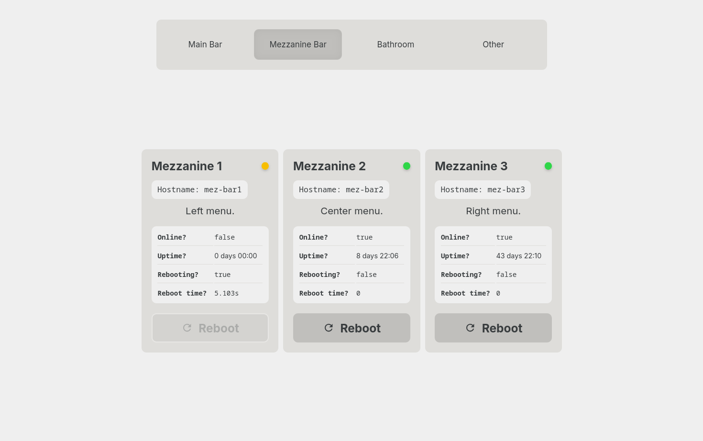

# sch-screen-manager
A Web dashboard for managing the Raspberry Pi-powered menu displays at Stoup Brewing Capitol Hill. Staff can check the status of the menu hosts and trigger remote reboots without needing to find someone technical. 



## The Problem
The venue runs 13 screens showing product lists, brewery hours, and advertisements for upcoming promotions or collaborations. Each screen is driven by a Raspberry Pi running a web browser, which can sometimes crash or hang on outdated information. 

Before this tool existed, if a technical staff member wasn't on hand to SSH in and reboot the Pi, a staff member would have to physically locate and power cycle the device, which could sometimes involve using a ladder to climb to difficult-to-reach areas. 

This tool allows staff to remotely monitor these screens (helpful for displays not visible from the main bar, which could be noticed by customers before staff) and trigger reboots without needing to physically power-cycle the down host. This results in a more seamless experience for guests and a safer experience for staff.

## What it does
- Shows live status and uptime for each display host
- Allows staff to remotely restart a screen's browser when it crashes
- Flags hosts that are completley unreachable, so a power or network failure looks different from a software problem

## Stack
React · Node.js · Express · Vite · Raspberry Pi OS · systemd

## How it works
The backend runs on a Raspberry Pi host on the network, which starts the Express server as a systemd service on boot. This backend provides an API for interacting with the screen display hosts via commands over SSH as well as a React-based frontend for making requests to this API.

Each screen host runs a web browser pointed at the proper menu endpoint. The content of these endpoints is managed remotely by our website CMS, and each screen's browser is launched and navigated to the proper endpoint on boot.

Staff navigate to the Express host's URL via tablets connected to the internal private network and are served a React-based frontend. The frontend divides screens into their physical groups - different bar menu sets or locations in the brewery. When a group is loaded, the frontend makes API requests to check for the status of the hosts in the group and schedules further requests to continually monitor their status. 

The UI also provides buttons to request a reboot of a given host via the backend API. If the menu isn't displaying properly due to software failure, an indicator will be shown for that host, and a staff member can use the reboot button to have the backend remotely trigger a reboot of the given host. Hardware failure events are indiciated in a different manner and will provide next steps for the staff when encountered.

## Local development
```bash
git clone 
cd sch-screen-manager
npm install
npm run dev
```

### Project Structure
The backend is handled via an express server and lives in `./backend`, and the frontend is built with React and lives in `./frontend`.

## Notes
- In 2026, dependencies were migrated from Node 19 to 24 LTS, React 18 to 19, Vite 5 to 8, and to an ESLint flat config.
- Unreachable hosts and crashed hosts have distinct states to indicate situations when physically accessing the Pi is still necessary (power off, network drop, or otherwise unreachable via SSH)
